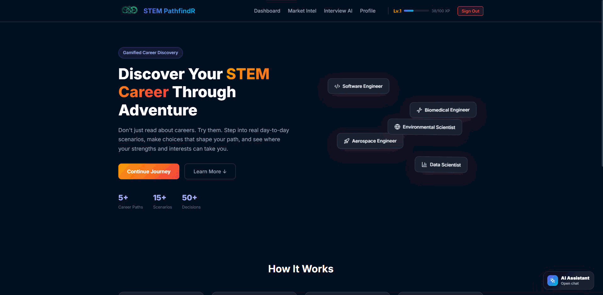
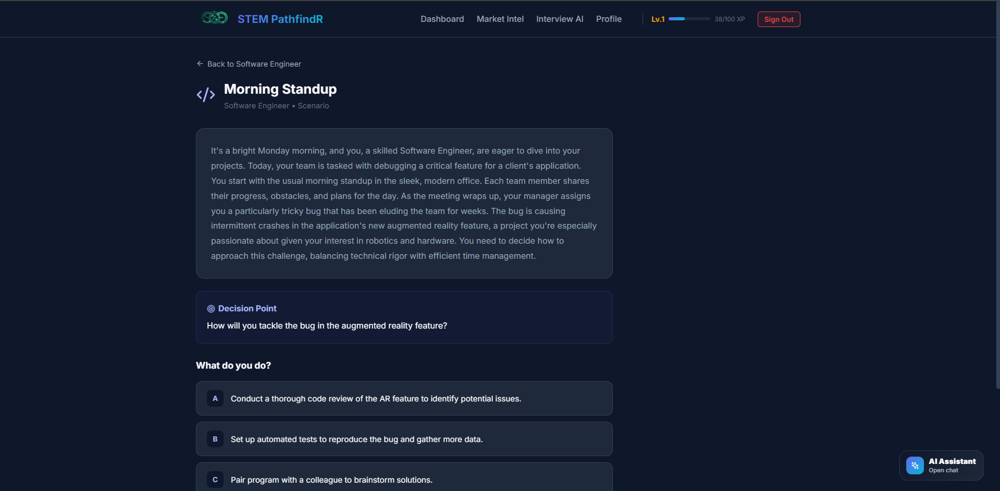
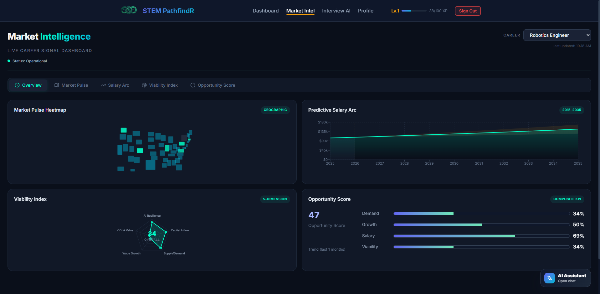
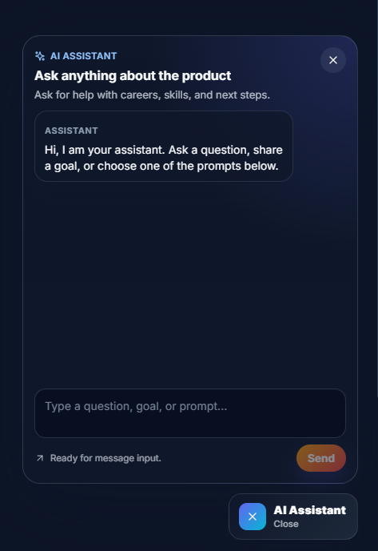

# STEM PathfindR

> **AI-Powered Gamified STEM Career Discovery Platform — AWS Hackathon 2026**

<p align="center">
  
</p>

STEM PathfindR helps high school and college students discover their ideal STEM career through AI-powered simulations, real-time labor market intelligence, and a full interview preparation suite. Instead of reading about careers, students *live* them — making decisions in realistic day-in-the-life scenarios, practicing interviews with pose detection, and seeing how their choices map to real market data.

---

## Live Demo

🌐 **[https://stem-pathfindr.vercel.app/](https://stem-pathfindr.vercel.app/)**

---

## Screenshots

<p align="center">
  <br/>
  <em>AI-generated career simulations with branching decisions and XP rewards</em>
</p>

<p align="center">
  <br/>
  <em>Live market intelligence with BLS data — heatmaps, salary projections, and viability analysis</em>
</p>

<p align="center">
  <br/>
  <em>Persistent AI career coach powered by AWS Bedrock</em>
</p>

---

## Problem Statement

Students choosing a career path rely on outdated guidance, vague job descriptions, or word-of-mouth. They can't experience what a job *actually feels like* before committing years of education. Meanwhile, labor market conditions shift rapidly — salaries change, demand fluctuates, and AI is reshaping entire fields.

STEM PathfindR solves this by combining:
- **AI-generated career simulations** that let students make real decisions in realistic scenarios
- **Live labor market intelligence** from Bureau of Labor Statistics so students see actual salary data, geographic demand, and career viability
- **A complete interview prep pipeline** — from resume optimization to mock interviews with body language analysis

---

## Features

### Interactive Career Simulations
- AI-powered day-in-the-life scenarios for 9 career paths (27 unique scenarios)
- Branching decision points with meaningful outcomes and correct answer feedback
- Trait discovery based on choices (analytical, collaborative, leadership, etc.)
- Powered by **AWS Bedrock** (Claude 3.5 Sonnet) with intelligent fallbacks

### Market Intelligence Dashboard
Live BLS data visualizations with 5 analysis panels:
- **Market Pulse Heatmap** — Geographic demand by state (BLS Location Quotients)
- **Predictive Salary Arc** — Historical wages + 10-year CAGR projections with confidence intervals
- **Viability Index Radar** — 5-dimension career health (AI displacement risk, capital inflow, supply/demand, wage growth, COLA-adjusted value)
- **Opportunity Score** — Composite KPI derived from all market signals
- **Overview** — All panels at a glance

### Interview Intelligence Suite
Three integrated tools powered by AWS Bedrock:

| Tool | Capabilities |
|------|-------------|
| **Smart Resume Engine** | Upload PDF → ATS scoring → keyword gap analysis → AI-optimized resume generation → PDF download |
| **AI Mock Interview** | Video + speech recognition → real-time body language analysis (TensorFlow.js MoveNet) → AI response scoring → follow-up questions |
| **Technical Assessment** | Coding problems tailored to job description → in-browser execution (JS + Python via Pyodide) → AI code review with complexity analysis |

### AI Career Assistant
- Persistent chat popup available on every page
- Curated persona: career coach + technical mentor + app navigator
- Context-aware guidance on STEM concepts, career roadmaps, and platform usage

### Multicultural AI Avatar System
- 9 illustrated diverse avatar characters with unique personalities and cultural backgrounds
- AI-powered contextual tips triggered at key checkpoints (landing, skill building, interviews)
- Mood detection and sentiment-aware responses (adjusts tone based on user engagement patterns)
- Deep-link action buttons for navigating directly to relevant features
- Conversation memory to avoid repeating advice
- Persona-based system prompts (each avatar has a distinct coaching style)

### Dark / Light Mode
- Full theme toggle with system preference detection
- CSS variable-based theming across all components
- Persists user preference via localStorage
- Floating toggle button accessible from any page

### Smart Onboarding
- 5-step quiz covering interests, skills, work style, and motivation
- Optional PDF resume upload for AI-based profile extraction
- LinkedIn profile import for automated data extraction
- If resume is incomplete, AI generates follow-up questions to fill gaps
- AI-driven career matching algorithm produces personalized recommendations

### SkillBridge — Personalized Learning Roadmaps
- Dream job picker with AI-powered skill requirements analysis
- Self-assessment sliders for honest skill evaluation
- Gap analysis with visual radar chart comparison
- AI-generated personalized learning roadmaps with timelines
- Inferred skill gains from simulation decisions
- Progress tracking dashboard with completion metrics

### Role Model Matching
- AI-powered matching of students to real STEM professionals
- Pulls verified data from Wikidata API
- Matches based on career goals, interests, and background
- Achievement and milestone displays for each role model

### Gamification & Progress Tracking
- XP system with leveling (scaling XP requirements)
- Achievement badges (Quick Thinker, Team Player, Deep Diver, First Step)
- Decision history and trait tracking
- Community leaderboard with rankings
- Progress persistence via Firebase Firestore

### Internationalization (i18n)
- Full multi-language support via react-i18next
- Language switcher in the UI
- Browser language auto-detection
- Extensible translation files (JSON-based)

### User Profiles
- Google + Email/Password authentication via Firebase Auth
- Downloadable PDF profile reports (jsPDF)
- Skills visualization and progress stats
- Badge collection display

---

## Career Paths

9 fully-developed STEM career paths, each with 3 simulation scenarios:

| Career | Field | Salary Range | Growth |
|--------|-------|-------------|--------|
| Software Engineer | Technology | $85K – $180K | 25% |
| Data Scientist | Technology & Mathematics | $90K – $160K | 36% |
| Biomedical Engineer | Engineering & Healthcare | $70K – $140K | 10% |
| Aerospace Engineer | Engineering | $80K – $160K | 8% |
| Environmental Scientist | Science | $60K – $120K | 8% |
| Cybersecurity Analyst | Technology & Security | $90K – $170K | 32% |
| Cloud Architect | Technology & Cloud | $120K – $210K | 26% |
| Robotics Engineer | Engineering & Automation | $95K – $175K | 14% |
| Renewable Energy Engineer | Engineering & Sustainability | $85K – $155K | 12% |

---

## 🛠️ Tech Stack

| Layer | Technology |
|-------|-----------|
| Frontend | React 18, React Router 6, Framer Motion |
| AI Engine | AWS Bedrock (Claude 3.5 Sonnet) via SigV4 |
| Pose Detection | TensorFlow.js + MoveNet (body language analysis) |
| Authentication | Firebase Auth (Google + Email/Password) |
| Database | Firebase Firestore |
| Market Data | Bureau of Labor Statistics API v2 (live) |
| Visualizations | Recharts, Chart.js, React Simple Maps, D3-Geo |
| PDF Processing | jsPDF (export), pdfjs-dist (client extraction), pdf-parse (server extraction) |
| Code Execution | In-browser JS eval + Pyodide (Python WASM runtime) |
| Backend | Express.js with aws4 (SigV4 signing), multer |
| Internationalization | react-i18next, i18next-browser-languagedetector |
| Icons | Lucide React |
| Styling | Custom CSS with variables, animations, dark/light theme |
| Deployment | Vercel (frontend) + Render (backend) |

---

## Getting Started

### Prerequisites
- Node.js 18+
- npm
- Firebase project (for auth & database)
- AWS account with Bedrock access (for AI features)
- BLS API key (free at [bls.gov](https://data.bls.gov/registrationEngine/))

### Installation

```bash
# Clone the repository
git clone https://github.com/Doctorpizza357/AWS.git
cd AWS

# Install frontend dependencies
npm install

# Install backend dependencies
cd server
npm install
cd ..

# Set up environment variables
cp .env.example .env
cp server/.env.example server/.env
```

### Environment Variables

**Frontend** (`.env`):
```env
REACT_APP_FIREBASE_API_KEY=your_api_key_here
REACT_APP_FIREBASE_AUTH_DOMAIN=your_project.firebaseapp.com
REACT_APP_FIREBASE_PROJECT_ID=your_project_id
REACT_APP_FIREBASE_STORAGE_BUCKET=your_project.appspot.com
REACT_APP_FIREBASE_MESSAGING_SENDER_ID=your_sender_id
REACT_APP_FIREBASE_APP_ID=your_app_id

REACT_APP_BLS_API_KEY=your_bls_v2_key
REACT_APP_API_URL=http://localhost:5000
```

**Backend** (`server/.env`):
```env
PORT=5000
AWS_ACCESS_KEY_ID=your_access_key_id
AWS_SECRET_ACCESS_KEY=your_secret_access_key
AWS_REGION=us-east-1
AWS_BEDROCK_MODEL_ID=anthropic.claude-3-5-sonnet-20241022-v2:0
```

### Running Locally

```bash
# Terminal 1: Start the backend
npm run server

# Terminal 2: Start the frontend
npm start
```

The frontend runs at `http://localhost:3000` with a CRA proxy forwarding `/api` requests to the backend at port 5000.

### Building for Production

```bash
npm run build
```

---

## Project Structure

```
├── server/                    # Express backend (AWS Bedrock proxy)
│   ├── index.js               # All API endpoints + SigV4 signing
│   └── package.json
├── src/
│   ├── components/
│   │   ├── market/            # Market Intelligence visualizations
│   │   │   ├── MarketPulseHeatmap.js
│   │   │   ├── PredictiveSalaryArc.js
│   │   │   ├── ViabilityIndexRadar.js
│   │   │   ├── OpportunityScore.js
│   │   │   └── StreamMatrix.js
│   │   ├── skillbridge/       # SkillBridge wizard components
│   │   │   ├── DreamJobPicker.js
│   │   │   ├── AssessmentSliders.js
│   │   │   ├── GapBarList.js
│   │   │   └── GapRadarChart.js
│   │   ├── AIAssistantPopup.js
│   │   ├── AvatarCard.js      # Multicultural AI avatar card
│   │   ├── ThemeToggle.js     # Dark/light mode toggle
│   │   ├── LanguageSwitcher.js
│   │   ├── CareerCard.js
│   │   ├── Navbar.js
│   │   ├── ProgressBar.js
│   │   └── ProtectedRoute.js
│   ├── context/
│   │   ├── AuthContext.js     # Firebase auth state
│   │   ├── UserContext.js     # User profile, XP, badges, Firestore sync
│   │   ├── InterviewContext.js
│   │   ├── MarketIntelligenceContext.js
│   │   ├── SkillBridgeContext.js
│   │   ├── AvatarContext.js   # AI avatar system with mood detection
│   │   └── ThemeContext.js    # Dark/light theme management
│   ├── data/
│   │   ├── careers.js         # 9 career definitions + 27 scenarios
│   │   ├── avatarData.js      # Avatar characters + checkpoint messages
│   │   └── badges.js          # Badge definitions
│   ├── i18n/
│   │   ├── index.js           # i18next configuration
│   │   └── locales/           # Translation JSON files
│   ├── pages/
│   │   ├── Landing.js         # Hero + feature showcase
│   │   ├── Login.js           # Auth page
│   │   ├── Onboarding.js      # Quiz + resume/LinkedIn upload
│   │   ├── Dashboard.js       # Main hub (stats, careers, badges)
│   │   ├── CareerPath.js      # Individual career detail
│   │   ├── Simulation.js      # AI scenario engine
│   │   ├── SkillBridge.js     # Personalized learning roadmaps
│   │   ├── MarketIntelligence.js  # Market data dashboard
│   │   ├── InterviewHub.js    # Interview suite navigation
│   │   ├── MockInterview.js   # Video mock interview + pose detection
│   │   ├── ResumeTailor.js    # Resume analysis + optimization
│   │   ├── TechnicalAssessment.js  # Code problems + AI review
│   │   ├── Leaderboard.js     # Community rankings
│   │   ├── RoleModels.js      # AI role model matching
│   │   ├── InterviewHistory.js
│   │   └── Profile.js
│   ├── services/
│   │   ├── aiService.js       # Scenario generation + assistant + career matching
│   │   ├── firebase.js        # Firebase initialization
│   │   ├── interviewService.js # Interview API client
│   │   ├── marketDataService.js # BLS API integration
│   │   ├── poseAnalyzer.js    # TensorFlow.js body language ML
│   │   ├── avatarRotationService.js  # Avatar selection + rotation
│   │   ├── avatarMessageService.js   # Message selection logic
│   │   └── moodService.js     # User mood/sentiment tracking
│   └── App.js                 # Routing + providers
└── public/
    ├── assets/avatars/        # Illustrated SVG avatar characters
    └── index.html
```

---

## AWS Integration

### AWS Bedrock (Claude 3.5 Sonnet)
All AI features route through the Express backend which signs requests using SigV4:
- Career simulation scenario generation
- Resume analysis and profile extraction
- Interview question generation and response analysis
- Code review and problem generation
- Career assistant chat
- Role model matching
- SkillBridge requirements analysis and roadmap generation

The backend handles authentication, request signing, and response parsing — no AWS credentials are exposed to the frontend.

### Security Architecture
- **Zero-Trust Model** — Browser treated as untrusted; all sensitive operations server-side
- **Client Isolation** — No AWS credentials or API keys stored in frontend code
- **Secure Transit** — PDF uploads parsed in memory only, never written to disk
- **SigV4 Per-Request** — Every Bedrock call signed individually, no cached tokens

### Architecture

```
Browser ──► React App ──► Express Backend ──► AWS Bedrock (SigV4)
                │                   │
                │                   └──► pdf-parse (resume extraction)
                │
                ├──► Firebase Auth (Google OAuth)
                ├──► Firebase Firestore (user data persistence)
                ├──► BLS API v2 (live market data, via CRA proxy)
                ├──► TensorFlow.js MoveNet (in-browser pose detection)
                ├──► Pyodide (in-browser Python execution)
                └──► Wikidata API (role model data)
```

---

## Data Sources

- **Bureau of Labor Statistics API v2** — OEWS employment/wage data, CPI-U inflation, Location Quotients
- **SOC Codes** — Standard Occupational Classification for precise career-to-data mapping
- **State FIPS codes** — Geographic employment distribution across 50 states
- **CPI-U** — Consumer Price Index for real wage growth calculations
- **Wikidata** — Verified professional profiles for role model matching

All market data is fetched live and projected forward using CAGR derived from historical observations.

---

## How It Works

1. **Onboard** → Take a 5-step quiz, upload your resume, or import LinkedIn for AI profile extraction
2. **Discover** → AI matches you with personalized career recommendations + real role models
3. **Simulate** → Enter immersive AI-generated scenarios and make decisions that earn XP
4. **Analyze** → View live market intelligence (salary trends, geographic demand, viability)
5. **Bridge** → Identify skill gaps and follow AI-generated learning roadmaps
6. **Prepare** → Upload a resume, get ATS feedback, practice mock interviews with AI coaching
7. **Progress** → Level up, collect badges, compete on the leaderboard, and refine your career direction

---

## Hackathon Highlights

| Differentiator | Description |
|----------------|-------------|
| **Live BLS Data** | Real salary/employment data, not mock — with 10-year projections and CPI-U adjustments |
| **Full-stack AI** | SigV4-signed Bedrock integration keeping secrets server-side |
| **5 AI Engines** | Career sim, resume optimizer, speech coach, code reviewer, role model matcher — all from one model |
| **Pose Detection** | TensorFlow.js MoveNet for real-time body language scoring during interviews |
| **In-browser Python** | Pyodide WASM runtime lets users write and run Python in the code editor |
| **9 Career Paths** | 27 unique branching scenarios with AI-generated variations on every play |
| **End-to-end Interview Pipeline** | Resume → ATS analysis → optimized resume → tailored questions → mock interview → code review |
| **Multicultural AI Avatars** | 9 diverse illustrated characters with persona-based coaching and mood detection |
| **SkillBridge Roadmaps** | AI-generated personalized learning plans with gap analysis and progress tracking |
| **i18n Support** | Multi-language interface with auto-detection |
| **Dark/Light Mode** | Full theme system with system preference detection |
| **Layered Security** | Zero-trust architecture with client isolation and in-memory-only data processing |

---

## Deployment

| Service | Platform | Branch |
|---------|----------|--------|
| Frontend | Vercel | `deploy/vercel-render` |
| Backend | Render | `deploy/vercel-render` |
| Source | GitHub | `main` |

The `deploy/vercel-render` branch syncs with `main` and adds platform-specific config files (`vercel.json`, `render.yaml`).

---

## License

This project was created for the AWS Hackathon 2026.
